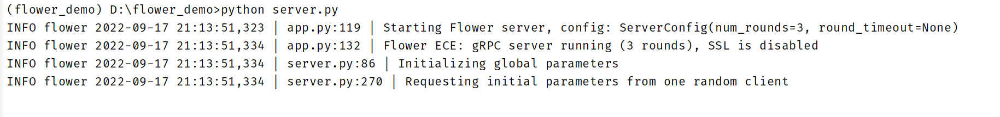
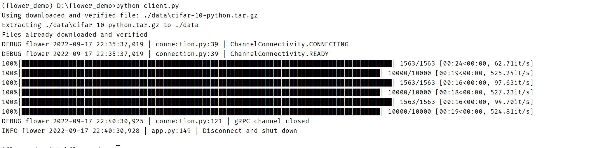
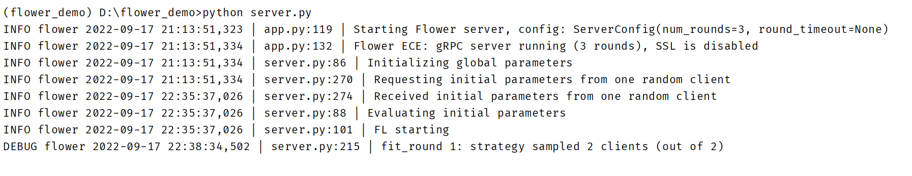

# Environment

| Name | Version    |
|------|------------|
| OS | Windows 11 |
| CUDA | 11.3       |
| Python | 3.9        |
| PyTorch | 1.12.1     |

# How to run

## 启动服务端

```sh
python server.py
```



## 启动客户端

启动两个以上客户端后自动开始训练

```shell
python client.py
```





# Instruction

代码结构较简单，在代码中的注释描述得比较清晰。
[官方文档](https://flower.dev/docs/index.html)